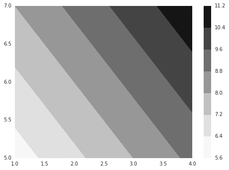

# meshgridとcontourfを可視化して理解してみた

numpy_meshgrid.py

```py3
# http://docs.scipy.org/doc/numpy-1.10.0/reference/generated/numpy.meshgrid.html
import numpy as np
import pandas as pd
import matplotlib.pyplot as plt
import seaborn as sns

%matplotlib inline


x, y = np.meshgrid([1,2,3,4], [5,6,7])
x_sp, y_sp = np.meshgrid([1,2,3,4], [5,6,7], sparse=True)
pd.concat(
    [pd.DataFrame(x), pd.DataFrame(y), pd.DataFrame(x + y)], axis=1)

# 第1引数はそのままの形で第2引数の長さ分行を追加
# 第2引数は転置して第1引数の長さ分列を追加
# sparseの場合は、追加しない
# 引数３つを使う場合は、Panelで確かめれば良い

	0	1	2	3	0	1	2	3	0	1	2	3
0	1	2	3	4	5	5	5	5	6	7	8	9
1	1	2	3	4	6	6	6	6	7	8	9	10
2	1	2	3	4	7	7	7	7	8	9	10	11

pd.concat(
    [pd.DataFrame(x_sp), pd.DataFrame(y_sp.T), pd.DataFrame(x_sp + y_sp)])

	0	1	2	3
0	1	2	3	4.0
0	5	6	7	NaN
0	6	7	8	9.0
1	7	8	9	10.0
2	8	9	10	11.0

contourf = plt.contourf(x, y, x + y)
plt.colorbar(contourf)

```



